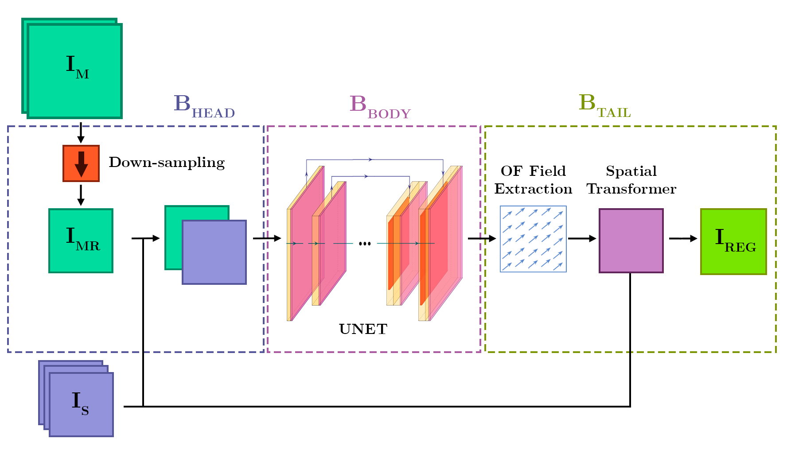

# FloU-Net: An Optical Flow Network for Multimodal Self-Supervised Image Registration

[Damian Ibañez](https://ieeexplore.ieee.org/author/37088513937), [Ruben Fernandez-Beltran](https://scholar.google.es/citations?user=pdzJmcQAAAAJ&hl=es), [Filiberto Pla](https://scholar.google.es/citations?user=mSSPcAMAAAAJ&hl=es)
---

This repository contains the codes for the GRSL paper: [FloU-Net: An Optical Flow Network for Multimodal Self-Supervised Image Registration](https://ieeexplore.ieee.org/document/10054383). Image registration is an essential task in image processing, where the final objective is to geometrically align two or more images. In remote sensing, this process allows comparing, fusing, or analyzing data, especially when multimodal images are used. In addition, multimodal image registration becomes fairly challenging when the images have a significant difference in scale and resolution, together with local small image deformations. For this purpose, this letter presents a novel optical flow (OF)-based image registration network, named the FloU-Net, which tries to further exploit intersensor synergies by means of deep learning. The proposed method is able to extract spatial information from resolution differences and through a U-Net backbone generate an OF field estimation to accurately register small local deformations of multimodal images in a self-supervised fashion. For instance, the registration between Sentinel-2 (S2) and Sentinel-3 (S3) optical data is not trivial, as there are considerable spectral–spatial differences among their sensors. In this case, the higher spatial resolution of S2 results in S2 data being a convenient reference to spatially improve S3 products, as well as those of the forthcoming Fluorescence Explorer (FLEX) mission, since image registration is the initial requirement to obtain higher data processing level products. To validate our method, we compare the proposed FloU-Net with other state-of-the-art techniques using 21 coupled S2/S3 optical images from different locations of interest across Europe. The comparison is performed through different performance measures. Results show that the proposed FloU-Net can outperform the compared methods.
                                                          



## Usage

`.main.py` is the main file.

`./codes/` contain the auxiliary files for models, losses and other functions.

The complete dataset and information of every coupled Sentinel-2/Sentinel-3 pair used in the experimentation can be found in: *in progress*

## Citation

```
@ARTICLE{10054383,
  author={Ibañez, Damian and Fernandez-Beltran, Ruben and Pla, Filiberto},
  journal={IEEE Geoscience and Remote Sensing Letters}, 
  title={FloU-Net: An Optical Flow Network for Multimodal Self-Supervised Image Registration}, 
  year={2023},
  volume={20},
  number={},
  pages={1-5},
  keywords={Spatial resolution;Image registration;Feature extraction;Sensors;Deformation;Optical sensors;Optical imaging;Convolutional neural networks (CNNs);image registration;intersensor;multimodal;multispectral;Sentinel-2 (S2);Sentinel-3 (S3)},
  doi={10.1109/LGRS.2023.3249902}}
```
